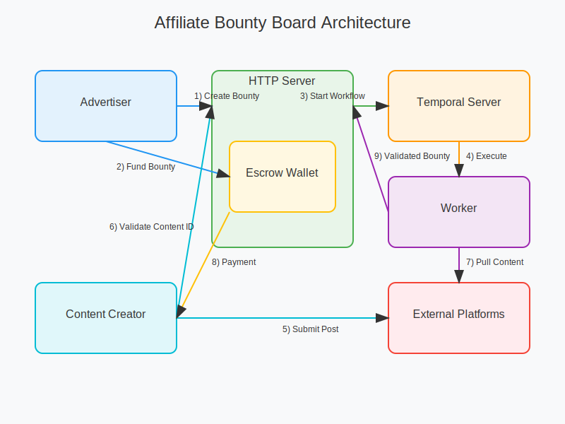
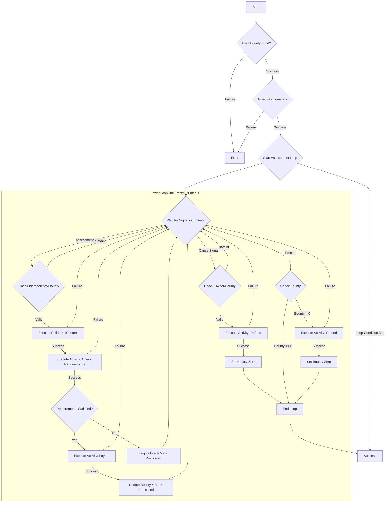
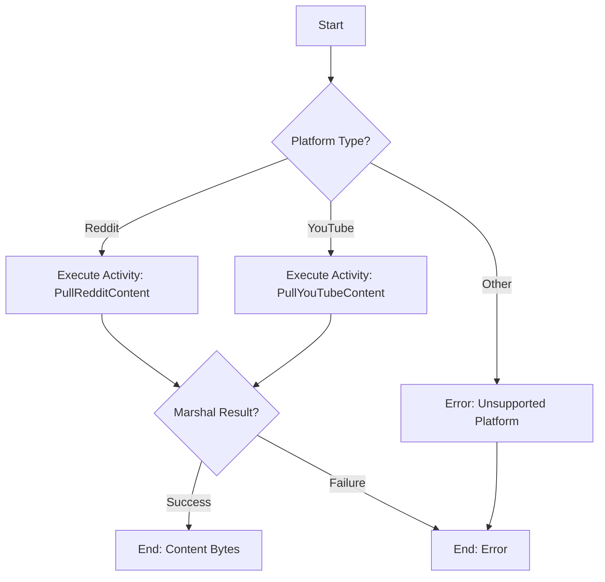
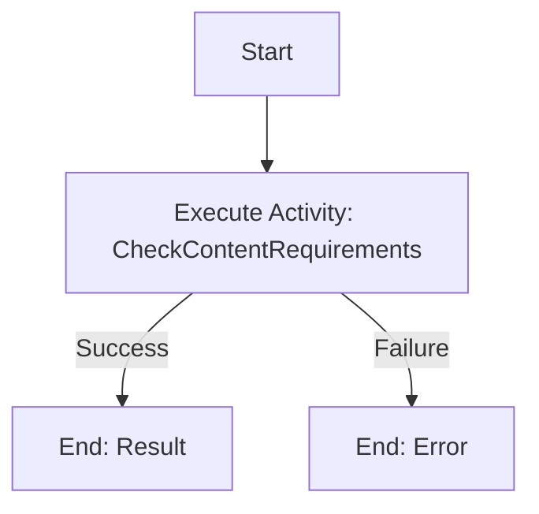
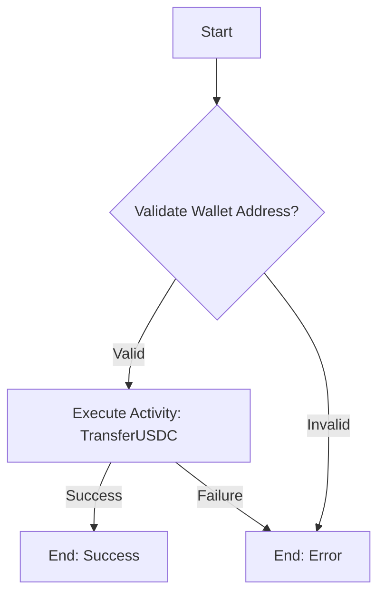

# affiliate-bounty-board

This project is a bounty board for online content creation, powered by Temporal workflows and Solana for payments. Advertisers can create bounties, and content creators can fulfill them to earn rewards.

## How It Works

1.  A **Funder** (e.g., a business owner) creates a bounty with a reward amount and specific requirements.
2.  A **Content Creator** sees the bounty on the board.
3.  The creator produces content that fulfills the bounty's requirements and submits a link along with their Solana wallet address.
4.  An automated system analyzes the content against the requirements.
5.  If the content is valid, the creator is paid in USDC from an escrow account.

## Current Limitations

1. Tripadvisor is a newly supported platform. Their API only allows for fetching the 5 most recent reviews for a location.
2. Bounties cannot be edited, but you can easily cancel and create a new bounty.
3. Payout amounts are fixed (i.e., no dynamic payout amounts).
4. Image analysis is limited to thumbnails; we'll be adding more powerful image analysis features in the very near future.

## Getting Started

### Prerequisites

- Go 1.24 or later
- Docker
- Make
- Temporal (typically running on k8s)

### Environment Setup

The application uses environment files for configuration. Before running any services, you must set up your configuration.

1.  **Copy the example files:** There are separate configurations for local debugging and production.

    ```bash
    # For local development
    cp server/.env.server.example .env.server.debug
    cp worker/.env.example .env.worker.debug

    # For production deployment
    cp server/.env.server.example .env.server.prod
    cp worker/.env.example .env.worker.prod
    ```

2.  **Update the `.env.*` files:** Fill in the necessary values for your setup, including:
    - Database credentials (`ABB_DATABASE_URL`)
    - Temporal connection details (`TEMPORAL_ADDRESS`, `TEMPORAL_NAMESPACE`)
    - Solana credentials and addresses
    - API keys for various platforms (Reddit, YouTube, etc.)

## Development & Operations via Makefile

All common development and operational tasks are managed through the `Makefile`.

### Local Development

The recommended way to run the project locally is with the integrated `tmux` development session. It starts the server, worker, and port-forwarding to your Temporal instance.

**Prerequisites:**

- Ensure `tmux` is installed (`brew install tmux` on macOS).
- Ensure `kubectl` is configured to access the cluster where Temporal is running.

**To start the development session:**

```bash
make start-dev-session
```

This command will:

1. Build the project's command-line interface (`abb`).
2. Start a new `tmux` session named `abb-dev`.
3. Create panes for the server, the worker, and a general-purpose CLI.
4. Start port-forwarding from your local machine to the Temporal frontend and web UI in Kubernetes.
5. Source the `.env.server.debug` file in the CLI panes for immediate use.

To stop the session and all related processes:

```bash
make stop-dev-session
```

### Testing

Run the full test suite:

```bash
make test
```

Generate and view a test coverage report:

```bash
make test-coverage
```

### Building

To build the `abb` CLI binary without running it:

```bash
make build-cli
```

To build and push a Docker image for the CLI (used by deployment targets):

```bash
make build-push-cli
```

### Kubernetes Deployment

**Prerequisites:**

- A Kubernetes cluster with an `nginx-ingress` controller and `cert-manager`.
- Your `.env.server.prod` and `.env.worker.prod` files must be populated with production values.

**Commands:**

- **Deploy server and workers:**

  ```bash
  make deploy-all
  ```

- **Deploy components individually:**

  ```bash
  make deploy-server
  make deploy-worker
  ```

- **Update Kubernetes secrets** from your `.env.*.prod` files without a full redeployment:

  ```bash
  make update-secrets-server
  make update-secrets-worker
  ```

- **Restart a deployment** to force a pod refresh:

  ```bash
  make restart-server
  make restart-worker
  ```

- **Delete all components** from the cluster:
  ```bash
  make delete-all
  ```

### Interacting with the Deployment

- **Check status:**

  ```bash
  make status
  ```

- **Tail logs:**

  ```bash
  make logs-server
  make logs-worker
  ```

- **Get detailed information** about a deployment:

  ```bash
  make describe-server
  make describe-worker
  ```

- **Port-forward** the server to your local machine:
  ```bash
  make port-forward-server
  ```

## Architecture

The application consists of two main components:

1. **Server**: HTTP API server that handles:

   - User authentication/token management
   - Bounty CRUDL endpoints

2. **Worker**: Temporal worker that:
   - Processes bounty workflows
   - Handles content assessment
   - Manages payment distribution

### System Architecture Diagram



The diagram above illustrates the flow of data and interactions between different components of the system:

- **Advertisers** create bounties through the HTTP Server
- The **HTTP Server** orchestrates the workflow by communicating with the Temporal Server
- The **Temporal Server** manages the workflow execution
- The **Worker** processes the workflow and interacts with Reddit
- **Content Creators** submit their posts to Reddit
- The system verifies the content and processes payments

## Contributing

1. Fork the repository
2. Create your feature branch
3. Commit your changes
4. Push to the branch
5. Create a new Pull Request

## License

This project is licensed under the MIT License - see the LICENSE file for details.

## Environment Setup

Load the environment variables using:

```bash
set -o allexport && source .env.server && set +o allexport
```

## Authentication

The project uses a two-step authentication process typical to what you'd see in a OAuth2 flow:

1. **Form with Credentials**: Used only for the `POST /token` endpoint to obtain a Bearer token

   - Client submits form data with the following fields
     - `username`: Your email
     - `password`: Server secret key

2. **Bearer Token**: Used for all other authenticated endpoints
   - Obtained from the `/token` endpoint
   - Passed in the `Authorization: Bearer <token>` header

## CLI Usage

### Server Commands

Start the HTTP server:

```bash
abb run http-server
```

### Admin Commands

Get a new Bearer token:

```bash
abb admin auth get-token --email your@email.com [--env-file .env.server]
```

Options:

- `--email`: Your email address (required)
- `--env-file`: Path to env file to update with new token
- `--endpoint`: Override server endpoint
- `--secret-key`: Override server secret key

**Note**: A running server is required to generate new tokens. Make sure to start the server in another terminal using `abb run http-server` before attempting to get a new token.

### Content Assessment Examples

The CLI provides commands for pulling and assessing content from various platforms:

#### Pulling Content

```bash
# Pull a Reddit post
./bin/abb debug pull-content \
  --platform reddit \
  --content-id t3_1johy3a \
  --reddit-user-agent "YourApp/1.0" \
  --reddit-username "your_username" \
  --reddit-password "your_password" \
  --reddit-client-id "your_client_id" \
  --reddit-client-secret "your_client_secret"

# Pull a YouTube video
./bin/abb debug pull-content \
  --platform youtube \
  --content-id yt_dQw4w9WgXcQ \
  --youtube-api-key "your_api_key" \
  --youtube-app-name "YourApp"
```

#### Assessing Content

You can pipe the output from `pull-content` directly into `check-requirements`:

```bash
# Assess a Reddit post
./bin/abb debug pull-content \
  --platform reddit \
  --content-id t3_1johy3a \
  --reddit-user-agent "YourApp/1.0" \
  --reddit-username "your_username" \
  --reddit-password "your_password" \
  --reddit-client-id "your_client_id" \
  --reddit-client-secret "your_client_secret" | \
./bin/abb debug check-requirements \
  --content - \
  --requirement "Content must be at least 500 words" \
  --requirement "Must discuss AI technology" \
  --requirement "Must be in English"

# Assess a YouTube video
./bin/abb debug pull-content \
  --platform youtube \
  --content-id yt_dQw4w9WgXcQ \
  --youtube-api-key "your_api_key" \
  --youtube-app-name "YourApp" | \
./bin/abb debug check-requirements \
  --content - \
  --requirement "Video must be at least 10 minutes long" \
  --requirement "Must include captions" \
  --requirement "Must be in English"
```

The `check-requirements` command supports additional parameters:

- `--openai-api-key`: Your OpenAI API key
- `--openai-model`: Model to use (defaults to "gpt-4")
- `--max-tokens`: Maximum tokens to generate (defaults to 1000)
- `--temperature`: Temperature for text generation (defaults to 0.7)

The output will be JSON containing:

```json
{
  "satisfies": true,
  "reason": "The content meets all requirements..."
}
```

## Temporal Workflows

The system uses Temporal for orchestrating the bounty verification process:

### Workflows

1. **BountyAssessmentWorkflow**

   - Handles the creation and initialization of new bounties, assessment, and payment.
   - Sets up escrow and initializes verification parameters

2. **SubmissionVerificationWorkflow**
   - Orchestrates the verification of user submissions
   - Coordinates with LLM for content analysis
   - Handles payment distribution

Below are diagrams illustrating the logic of the primary workflows:

#### `BountyAssessmentWorkflow`



#### `PullContentWorkflow`



#### `CheckContentRequirementsWorkflow`



#### `PayBountyWorkflow`



### Activities

1. **RedditActivities**

   - Fetch post content
   - Verify post existence and ownership
   - Check post metrics

2. **LLMActivities**

   - Analyze post content
   - Verify requirements compliance
   - Generate verification reports

3. **PaymentActivities**
   - Handle escrow management
   - Process payments to users
   - Track payment status

## LLM Integration

- The system uses an LLM (e.g., OpenAI's GPT models) for content analysis:
- Verifies post content against bounty requirements
- Analyzes sentiment and context
- Checks for keyword presence and usage
- Generates detailed verification reports

- The base prompt used for content verification can be configured using the `LLM_CHECK_REQ_PROMPT_BASE` environment variable. This variable should contain the base64 encoded version of the desired base prompt text.
- You can generate a base64 encoded prompt using a command like this (saving the output to a file or directly setting the environment variable):

  ```bash
  # Example command to base64 encode a custom prompt
  echo -n "You are a content verification system.\n\nYour task is to determine if the given content satisfies the\n\nspecified requirements. Be sure to have a reason for you decision. The content to evaluate is provided as a JSON object below.\n" | base64 > prompt.txt
  # You would then set LLM_CHECK_REQ_PROMPT_BASE=$(cat prompt.txt)
  ```

- Required environment variables for the chosen LLM provider (e.g., OpenAI):
  ```bash
  LLM_PROVIDER=openai
  LLM_API_KEY=your_api_key
  LLM_MODEL=gpt-4o-mini
  # LLM_CHECK_REQ_PROMPT_BASE=... (Optional, base64 encoded prompt)
  ```

## Deployment Considerations

### Backend Deployment

1. Set up a production Temporal cluster
2. Configure proper environment variables
3. Set up monitoring and logging
4. Configure rate limiting and security measures

### Security Considerations

- Use HTTPS in production
- Implement proper rate limiting
  - API endpoints: 100 requests per minute per IP
  - Authentication endpoints: 5 attempts per minute per IP
  - Submission endpoints: 10 submissions per hour per user
  - Bounty creation: 5 bounties per day per advertiser
  - Consider implementing a token bucket algorithm for smooth rate limiting
  - Use Redis or similar for distributed rate limiting in production
- Set up monitoring and alerting
- Regular security audits
- Proper secret management

## Solana Wallet Management

**IMPORTANT:** The `solana` and `spl-token` commands connect to the network specified in your Solana CLI configuration. For these instructions, ensure your configuration points to Devnet, like the example shown below:

```bash
 »  solana config get
Config File: /Users/brojonat/.config/solana/cli/config.yml
RPC URL: https://api.devnet.solana.com
WebSocket URL: wss://api.devnet.solana.com/ (computed)
Keypair Path: /Users/brojonat/.config/solana/id.json
Commitment: confirmed
```

On Solana, your main wallet address (like the one derived from your keypair) doesn't directly hold SPL Tokens such as USDC. Instead, you need a separate Associated Token Account (ATA) specifically for USDC that is owned by your main wallet; this ATA's address is automatically derived from your main wallet address and the USDC mint address. We pay the (inexpensive) rent fee for creating this account if it doesn't exist.

These steps outline how to generate a new Solana keypair, fund it on devnet, and retrieve its private key using the `abb` CLI. It also delves into some USDC ATA commands.

### 1. Generate a New Keypair

Use the Solana CLI tool to create a new keypair file. Choose a memorable path, for example, `~/.config/solana/my_new_wallet.json`.

```bash
# Install Solana tools if you haven't already: https://docs.solana.com/cli/install
solana-keygen new --outfile ~/.config/solana/my_new_wallet.json
```

This command will output the public key (wallet address) and save the keypair to the specified file. Keep this file secure.

### 2. Fund the Wallet (Airdrop)

You can request SOL tokens for your new wallet on networks like devnet or testnet using the `solana airdrop` command. Replace `<YOUR_NEW_WALLET_ADDRESS>` with the public key generated in the previous step.

```bash
# Make sure your Solana CLI is configured for the desired network (e.g., devnet)
# solana config set --url https://api.devnet.solana.com

# Request an airdrop (amount may vary by network)
solana airdrop 2 <YOUR_NEW_WALLET_ADDRESS>
```

Wait for the transaction to confirm. You can check the balance with `solana balance <YOUR_NEW_WALLET_ADDRESS>`.

### 3. Print the Private Key

Use the `abb` CLI utility to print the private key in base58 format from your keypair file. This is useful if you need to import the wallet into another application or service.

```bash
# First, ensure the CLI is built
make build-cli

# Print the private key
./bin/abb util print-private-key --keypair-path ~/.config/solana/my_new_wallet.json
```

If your keypair is located at the default path (`~/.config/solana/id.json`), you can omit the `--keypair-path` flag:

```bash
./bin/abb util print-private-key
```

**Important:** Handle your private keys with extreme care. Never commit them to version control or share them publicly.

### 4. Finding Token Accounts and Checking Balances (spl-token)

Unlike SOL which is held directly by your main wallet address, SPL Tokens (like USDC) are held in separate Associated Token Accounts (ATAs) linked to your main wallet. You often need to find the address of an ATA or check its token balance.

The `spl-token` command-line utility is essential for this. (You might need to install the Solana Tool Suite if you don't have it: `sh -c "$(curl -sSfL https://release.solana.com/v1.18.4/install)"` - check Solana docs for latest).

**Finding an Associated Token Account (ATA) Address:**

To find the specific ATA address for a given owner wallet and a specific token mint:

```bash
# Replace <TOKEN_MINT_ADDRESS> with the mint (e.g., Devnet USDC)
# Replace <OWNER_WALLET_ADDRESS> with the main wallet address

spl-token address --token <TOKEN_MINT_ADDRESS> --owner <OWNER_WALLET_ADDRESS>

# Example for Native Devnet USDC (Gh9Zw...):
spl-token address --token Gh9ZwEmdLJ8DscKNTkTqPbNwLNNBjuSzaG9Vp2KGtKJr --owner AuQiyiWqPVHYhv9emCGfZm6oWaic4ojBHzqK4cv6Np4V

# Example for Wrapped Devnet USDC (4zMMC...):
spl-token address --token 4zMMC9srt5Ri5X14GAgXhaHii3GnPAEERYPJgZJDncDU --owner AuQiyiWqPVHYhv9emCGfZm6oWaic4ojBHzqK4cv6Np4V

# Example leveraging envs
spl-token address --owner $SOLANA_TEST_CREATOR_WALLET --token $SOLANA_USDC_MINT_ADDRESS --verbose

# You can create this account if it doesn't exist
spl-token create-account $SOLANA_USDC_MINT_ADDRESS --owner $SOLANA_TEST_CREATOR_WALLET --fee-payer ~/.config/solana/id.json
```

This command prints the derived ATA address.

**Checking the Token Balance of an Account:**

Once you know the address of a specific token account (like an ATA), you can check its balance:

```bash
# Replace <TOKEN_ACCOUNT_ADDRESS> with the ATA address you found
# Replace <RPC_ENDPOINT> with your Devnet RPC URL (e.g., https://api.devnet.solana.com)

spl-token balance --address <TOKEN_ACCOUNT_ADDRESS>

# Example checking the wrapped USDC ATA derived above:
spl-token balance --address 5U7XDWrusNB6zTGZ8dazJsu67MDzWMco3WGKFYkiLjt1
```

This command shows the balance of the specific SPL Token held by that account address. Remember that the ATA itself usually holds 0 SOL; its SOL balance is irrelevant.

**Put it all Together: Host a Bounty:**

```bash
# First let's inspect a hypothentical creator's USDC balance:
export SOLANA_TEST_CREATOR_USDC_ACA=$(spl-token address --owner $SOLANA_TEST_CREATOR_WALLET --token $SOLANA_USDC_MINT_ADDRESS -v --output json | jq -r '.associatedTokenAddress')
# This account may or may not actually exist. The payment process is robust to this,
# but just note that if you try to check the balance and it doesn't exist, you'll
# get a "not found" error. If you want, you can create the wallet with the
# following command, but it's not necessary
spl-token create-account $SOLANA_USDC_MINT_ADDRESS --owner $SOLANA_TEST_CREATOR_WALLET --fee-payer ~/.config/solana/id.json
# And now check the balance (you should see 0)
spl-token balance --address $SOLANA_TEST_CREATOR_USDC_ACA
# Ok, now, pretend a hypothetical advertiser creates a bounty. This will use SOLANA_TEST_FUNDER_WALLET by default
./bin/abb admin bounty create -r "write a post in r/orangecounty that is about microcenter and has at least 100 comments" --total 1 --per-post 0.05
# Now fund the bounty escrow within the timeout window. This will use the
# SOLANA_TEST_FUNDER_WALLET and SOLANA_TEST_FUNDER_PRIVATE_KEY by default
./bin/abb admin util fund-escrow -a 1.0 -w bounty-some-uuid
# Ok, the bounty loop is now "hot" and handling requests to asseess and payout.
# Give it something to assess. This will pay out to SOLANA_TEST_CREATOR_WALLET
# by default if the content meets specfication
./bin/abb admin bounty assess --content-id 1k3hp5k --platform reddit --bounty bounty-some-uuid
# This should have triggered. You should be able to check the creator wallet and
# see that it got a bounty payout. You can of course also check the Temporal UI.
spl-token balance --address $SOLANA_TEST_CREATOR_USDC_ACA

# The bounty will run until it either runs out of funds or times out.
# If it times out, it will send the remaining funds back to the
# bounty owner ($SOLANA_TEST_OWNER_WALLET by default).
```
